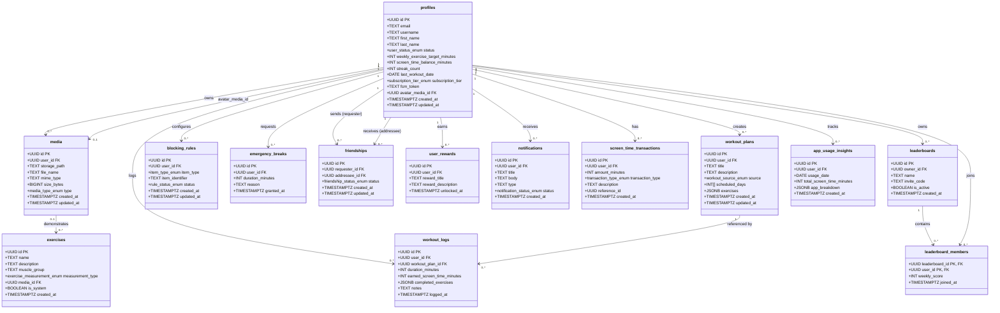

```mermaid
classDiagram
    class profiles {
        +UUID id PK
        +TEXT email
        +TEXT username
        +TEXT first_name
        +TEXT last_name
        +user_status_enum status
        +INT weekly_exercise_target_minutes
        +INT screen_time_balance_minutes
        +INT streak_count
        +DATE last_workout_date
        +subscription_tier_enum subscription_tier
        +TEXT fcm_token
        +UUID avatar_media_id FK
        +TIMESTAMPTZ created_at
        +TIMESTAMPTZ updated_at
    }

    class media {
        +UUID id PK
        +UUID user_id FK
        +TEXT storage_path
        +TEXT file_name
        +TEXT mime_type
        +BIGINT size_bytes
        +media_type_enum type
        +TIMESTAMPTZ created_at
        +TIMESTAMPTZ updated_at
    }

    class exercises {
        +UUID id PK
        +TEXT name
        +TEXT description
        +TEXT muscle_group
        +exercise_measurement_enum measurement_type
        +UUID media_id FK
        +BOOLEAN is_system
        +TIMESTAMPTZ created_at
    }

    class workout_plans {
        +UUID id PK
        +UUID user_id FK
        +TEXT title
        +TEXT description
        +workout_source_enum source
        +INT[] scheduled_days
        +JSONB exercises
        +TIMESTAMPTZ created_at
        +TIMESTAMPTZ updated_at
    }

    class workout_logs {
        +UUID id PK
        +UUID user_id FK
        +UUID workout_plan_id FK
        +INT duration_minutes
        +INT earned_screen_time_minutes
        +JSONB completed_exercises
        +TEXT notes
        +TIMESTAMPTZ logged_at
    }

    class blocking_rules {
        +UUID id PK
        +UUID user_id FK
        +item_type_enum item_type
        +TEXT item_identifier
        +rule_status_enum status
        +TIMESTAMPTZ created_at
        +TIMESTAMPTZ updated_at
    }

    class emergency_breaks {
        +UUID id PK
        +UUID user_id FK
        +INT duration_minutes
        +TEXT reason
        +TIMESTAMPTZ granted_at
    }

    class friendships {
        +UUID id PK
        +UUID requester_id FK
        +UUID addressee_id FK
        +friendship_status_enum status
        +TIMESTAMPTZ created_at
        +TIMESTAMPTZ updated_at
    }

    class user_rewards {
        +UUID id PK
        +UUID user_id FK
        +TEXT reward_title
        +TEXT reward_description
        +TIMESTAMPTZ unlocked_at
    }

    class notifications {
        +UUID id PK
        +UUID user_id FK
        +TEXT title
        +TEXT body
        +TEXT type
        +notification_status_enum status
        +TIMESTAMPTZ created_at
    }

    class screen_time_transactions {
        +UUID id PK
        +UUID user_id FK
        +INT amount_minutes
        +transaction_type_enum transaction_type
        +TEXT description
        +UUID reference_id
        +TIMESTAMPTZ created_at
    }

    class leaderboards {
        +UUID id PK
        +UUID owner_id FK
        +TEXT name
        +TEXT invite_code
        +BOOLEAN is_active
        +TIMESTAMPTZ created_at
    }

    class leaderboard_members {
        +UUID leaderboard_id PK, FK
        +UUID user_id PK, FK
        +INT weekly_score
        +TIMESTAMPTZ joined_at
    }

    class app_usage_insights {
        +UUID id PK
        +UUID user_id FK
        +DATE usage_date
        +INT total_screen_time_minutes
        +JSONB app_breakdown
        +TIMESTAMPTZ created_at
    }

    %% Relationships
    profiles "1" --> "0..*" media : owns
    profiles "1" --> "0..1" media : avatar_media_id
    media "0..1" --> "0..*" exercises : demonstrates

    profiles "1" --> "0..*" workout_plans : creates
    profiles "1" --> "0..*" workout_logs : logs
    workout_plans "1" --> "0..*" workout_logs : referenced by

    profiles "1" --> "0..*" blocking_rules : configures
    profiles "1" --> "0..*" emergency_breaks : requests

    profiles "1" --> "0..*" friendships : sends (requester)
    profiles "1" --> "0..*" friendships : receives (addressee)

    profiles "1" --> "0..*" user_rewards : earns
    profiles "1" --> "0..*" notifications : receives
    profiles "1" --> "0..*" screen_time_transactions : has

    profiles "1" --> "0..*" leaderboards : owns
    leaderboards "1" --> "0..*" leaderboard_members : contains
    profiles "1" --> "0..*" leaderboard_members : joins

    profiles "1" --> "0..*" app_usage_insights : tracks
```
