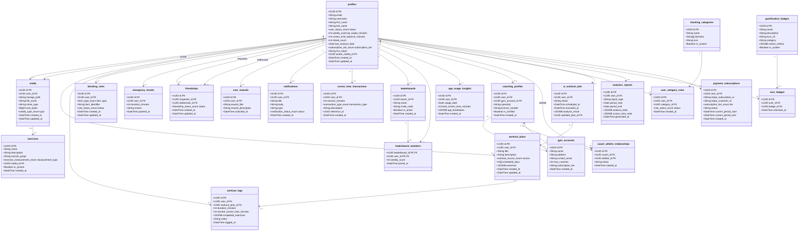

# Nashaat — Class Diagram

```mermaid
classDiagram

    %% ──────────────────────────────────────────
    %% EXISTING TABLES
    %% ──────────────────────────────────────────

    class profiles {
        +UUID id PK
        +String email
        +String username
        +String first_name
        +String last_name
        +user_status_enum status
        +Int weekly_exercise_target_minutes
        +Int screen_time_balance_minutes
        +Int streak_count
        +Date last_workout_date
        +subscription_tier_enum subscription_tier
        +String fcm_token
        +UUID avatar_media_id FK
        +DateTime created_at
        +DateTime updated_at
    }

    class media {
        +UUID id PK
        +UUID user_id FK
        +String storage_path
        +String file_name
        +String mime_type
        +BigInt size_bytes
        +media_type_enum type
        +DateTime created_at
        +DateTime updated_at
    }

    class exercises {
        +UUID id PK
        +String name
        +String description
        +String muscle_group
        +exercise_measurement_enum measurement_type
        +UUID media_id FK
        +Boolean is_system
        +DateTime created_at
    }

    class workout_plans {
        +UUID id PK
        +UUID user_id FK
        +String title
        +String description
        +workout_source_enum source
        +Int[] scheduled_days
        +JSONB exercises
        +DateTime created_at
        +DateTime updated_at
    }

    class workout_logs {
        +UUID id PK
        +UUID user_id FK
        +UUID workout_plan_id FK
        +Int duration_minutes
        +Int earned_screen_time_minutes
        +JSONB completed_exercises
        +String notes
        +DateTime logged_at
    }

    class blocking_rules {
        +UUID id PK
        +UUID user_id FK
        +item_type_enum item_type
        +String item_identifier
        +rule_status_enum status
        +DateTime created_at
        +DateTime updated_at
    }

    class emergency_breaks {
        +UUID id PK
        +UUID user_id FK
        +Int duration_minutes
        +String reason
        +DateTime granted_at
    }

    class friendships {
        +UUID id PK
        +UUID requester_id FK
        +UUID addressee_id FK
        +friendship_status_enum status
        +DateTime created_at
        +DateTime updated_at
    }

    class user_rewards {
        +UUID id PK
        +UUID user_id FK
        +String reward_title
        +String reward_description
        +DateTime unlocked_at
    }

    class notifications {
        +UUID id PK
        +UUID user_id FK
        +String title
        +String body
        +String type
        +notification_status_enum status
        +DateTime created_at
    }

    class screen_time_transactions {
        +UUID id PK
        +UUID user_id FK
        +Int amount_minutes
        +transaction_type_enum transaction_type
        +String description
        +UUID reference_id
        +DateTime created_at
    }

    class leaderboards {
        +UUID id PK
        +UUID owner_id FK
        +String name
        +String invite_code
        +Boolean is_active
        +DateTime created_at
    }

    class leaderboard_members {
        +UUID leaderboard_id PK FK
        +UUID user_id PK FK
        +Int weekly_score
        +DateTime joined_at
    }

    class app_usage_insights {
        +UUID id PK
        +UUID user_id FK
        +Date usage_date
        +Int total_screen_time_minutes
        +JSONB app_breakdown
        +DateTime created_at
    }

    %% ──────────────────────────────────────────
    %% EXISTING RELATIONSHIPS
    %% ──────────────────────────────────────────

    profiles "1" --> "0..*" media
    profiles "1" --> "0..1" media : avatar
    media "0..1" --> "0..*" exercises
    profiles "1" --> "0..*" workout_plans
    profiles "1" --> "0..*" workout_logs
    workout_plans "1" --> "0..*" workout_logs
    profiles "1" --> "0..*" blocking_rules
    profiles "1" --> "0..*" emergency_breaks
    profiles "1" --> "0..*" friendships : requester
    profiles "1" --> "0..*" friendships : addressee
    profiles "1" --> "0..*" user_rewards
    profiles "1" --> "0..*" notifications
    profiles "1" --> "0..*" screen_time_transactions
    profiles "1" --> "0..*" leaderboards
    leaderboards "1" --> "0..*" leaderboard_members
    profiles "1" --> "0..*" leaderboard_members
    profiles "1" --> "0..*" app_usage_insights

    %% ──────────────────────────────────────────
    %% FUTURE TABLES
    %% ──────────────────────────────────────────

    %% FUTURE
    class coaching_profiles {
        +UUID id PK
        +UUID user_id FK
        +UUID gym_account_id FK
        +String specialty
        +String license_number
        +Boolean is_verified
        +DateTime created_at
    }

    %% FUTURE
    class coach_athlete_relationships {
        +UUID id PK
        +UUID coach_id FK
        +UUID athlete_id FK
        +String status
        +DateTime started_at
    }

    %% FUTURE
    class gym_accounts {
        +UUID id PK
        +String name
        +String address
        +String contact_email
        +Int max_coaches
        +String subscription_tier
        +DateTime created_at
    }

    %% FUTURE
    class blocking_categories {
        +UUID id PK
        +String name
        +String[] domains
        +String icon
        +Boolean is_system
    }

    %% FUTURE
    class user_category_rules {
        +UUID id PK
        +UUID user_id FK
        +UUID category_id FK
        +rule_status_enum status
        +DateTime created_at
    }

    %% FUTURE
    class ai_workout_jobs {
        +UUID id PK
        +UUID user_id FK
        +String status
        +DateTime scheduled_at
        +DateTime executed_at
        +JSONB analysis_result
        +UUID updated_plan_id FK
    }

    %% FUTURE
    class analytics_reports {
        +UUID id PK
        +UUID user_id FK
        +String report_type
        +Date period_start
        +Date period_end
        +JSONB workout_stats
        +JSONB screen_time_stats
        +DateTime generated_at
    }

    %% FUTURE
    class gamification_badges {
        +UUID id PK
        +String name
        +String description
        +String icon_url
        +String category
        +JSONB unlock_criteria
        +Boolean is_system
    }

    %% FUTURE
    class user_badges {
        +UUID id PK
        +UUID user_id FK
        +UUID badge_id FK
        +DateTime unlocked_at
    }

    %% FUTURE
    class payment_subscriptions {
        +UUID id PK
        +UUID user_id FK
        +String stripe_subscription_id
        +String stripe_customer_id
        +subscription_tier_enum tier
        +String status
        +DateTime current_period_start
        +DateTime current_period_end
        +DateTime created_at
    }

    %% ──────────────────────────────────────────
    %% FUTURE RELATIONSHIPS
    %% ──────────────────────────────────────────

    profiles "1" --> "0..1" coaching_profiles
    coaching_profiles "0..*" --> "0..1" gym_accounts
    gym_accounts "1" --> "0..*" coaching_profiles
    coaching_profiles "1" --> "0..*" coach_athlete_relationships
    profiles "1" --> "0..*" coach_athlete_relationships : athlete
    blocking_categories "1" --> "0..*" user_category_rules
    profiles "1" --> "0..*" user_category_rules
    profiles "1" --> "0..*" ai_workout_jobs
    ai_workout_jobs "0..*" --> "0..1" workout_plans
    profiles "1" --> "0..*" analytics_reports
    gamification_badges "1" --> "0..*" user_badges
    profiles "1" --> "0..*" user_badges
    profiles "1" --> "0..1" payment_subscriptions
```
