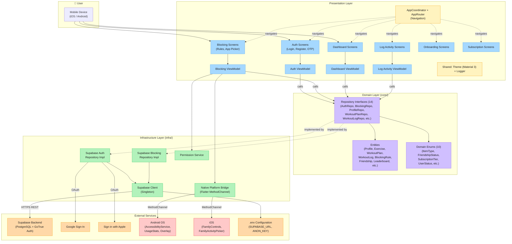

# Nashaat - High-Level System Architecture

## Data Flow Summary

1. **Auth Flow**: User → Auth Screens → AuthViewModel → AuthRepository Interface → SupabaseAuthRepository Impl → Supabase GoTrue / Google / Apple
2. **Blocking Flow**: User → Blocking Screens → BlockingViewModel → BlockingRepository Interface → SupabaseBlockingRepository Impl → Supabase DB + Native Platform Bridge → Android/iOS OS
3. **Navigation**: AppCoordinator holds GlobalKey\<NavigatorState\> and routes between all feature screens via AppRouter's onGenerateRoute
4. **All DB Access**: ViewModels → Abstract Repository Interfaces → Concrete Supabase Implementations → Supabase Client Singleton → HTTPS to Supabase Backend
